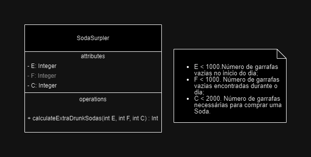

# e2-memes

## Problema

[Refrigerante](https://www.beecrowd.com.br/judge/pt/problems/view/3214)

## Integrantes

- Edson Costa
- Eduardo Soares
- Kevin Boucinha

## Caso de Teste

```Gherkin
Feature: Soda Surpler Calculation

  Scenario: Tim's extra thirsty day
    Given Tim has E empty soda bottles at the start of the day
    And he finds F empty soda bottles during the day
    And it takes C empty bottles to buy a new soda
    When Tim calculates how many sodas he can drink
    Then Tim should have an output of the number of sodas he drank

Examples:
  | E   | F   | C   | Sodas Drank |
  | 9   | 0   | 3   | 4           |
  | 5   | 5   | 2   | 9           |
```

## Diagrama



## Solution

```c
#include <stdio.h>

int main() {
    int tests;
    
    printf("input how many test you want to run:\n");
    scanf("%d", &tests);

    while(tests--) {
        int e, f, c;

        printf("input e, f and c values separated by spaces:\n");
        scanf("%d %d %d", &e, &f, &c);
        
        e += f;
        int ans = 0;
        
        while(e >= c) {
            ans += e/c;
            e = e%c + e/c;
        }
        
        printf("%d\n", ans);
    }
    return 0;
}
```